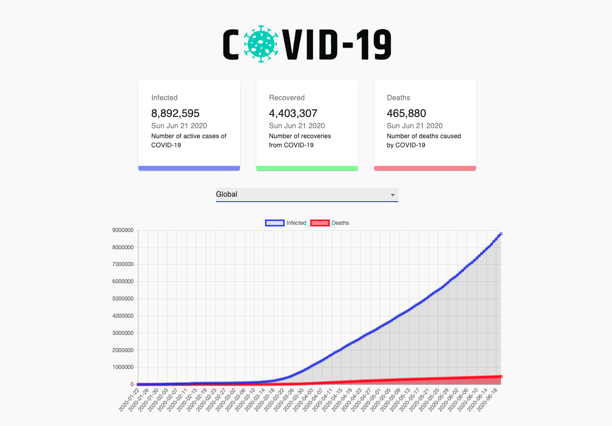

# Covid-19 tracker 🦠

A React app to see some of the latest statistics for Covid-19 cases in different countries. Live link [here](https://covid-19-tracker-reactjs.netlify.app/)!



[Objective](#objective) | [Technologies used](#tech) | [Running the program](#running_the_program)

## <a name="objective">Objective</a>

Further studying of React, using [this youtube tutorial]().

In particular, learning how to apply the following concepts:
- Packages: 
  - Chart.js
  - CountUp
  - classnames
- Material-UI
  - NativeSelect
  - FormControl

## <a name="tech">Technologies used</a>

- Frontend: React
- API: https://covid19.mathdro.id/api
- CI & CD: Netlify
- Styling frameworks: Material-UI

## <a name="running_the_program">Running the program</a>

### Setup
```
$ git clone https://github.com/jasylwong/covid-19-tracker.git
$ cd covid-19-tracker
$ npm i
$ npm start
```
